<!-- Banner: self-contained animated SVG, no third-party service -->
<p align="center">
  
</p>

<p align="center">
  <strong>The gamified AI coach that walks a total beginner — anywhere in the world — from zero to their first freelance paycheck.</strong><br/>
  A coach, not a course. Advisory only: it guides, you do the work. It never touches your marketplace accounts.
</p>

<p align="center">
  <a href="https://launch-pilot-mu.vercel.app"></a>
  
  
  <a href="LICENSE"></a>
</p>

<p align="center">
  
  
  
  
  
</p>

<p align="center">
  <a href="https://launch-pilot-mu.vercel.app"><b>Try it live</b></a> ·
  <a href="#-quick-start">Quick start</a> ·
  <a href="#-how-it-works">How it works</a> ·
  <a href="#-roadmap">Roadmap</a> ·
  <a href="#-contributing">Contribute</a>
</p>

---

## Why LaunchPilot

Millions of capable people want to freelance but stall at the same place: *how do I actually start?* Which platform, which skill, what to charge, how to write a proposal that isn't ignored, how to avoid getting scammed or banned. The advice online is generic, often wrong, and rarely honest about timelines.

**LaunchPilot** is a warm, honest AI coach named **Atlas** that gives one person a personalized path: assess your skills, build a realistic roadmap, draft your profile and gigs, and answer questions grounded in a curated, versioned knowledge base for **17 freelance platforms** — Fiverr and Upwork plus 15 remote job boards. It works for a newcomer anywhere, and ships **first-class support for underserved markets** (Bangladesh is the flagship: local payout rails, honest fee math) so the guidance is real, not hand-wavy.

> [!IMPORTANT]
> **Advisory only, by design.** LaunchPilot never calls marketplace APIs, scrapes, or automates your account — that violates their terms and can get *you* banned. It drafts assets and coaches you through publishing them yourself. See [ADR-0001](docs/decision-log.md).

## ✨ Features

| | Feature | What it does |
|---|---|---|
| 🧭 | **Conversational onboarding** | Adaptive skill assessment in English or বাংলা, with tap-to-listen audio. |
| 🗺️ | **Personalized 90-day roadmap** | A grounded, version-pinned journey of missions tailored to *your* skill, platform, and hours. |
| 💬 | **Atlas, the AI coach** | Streaming answers grounded in curated platform knowledge; refuses TOS-violating asks; never promises a guaranteed outcome. |
| 🚀 | **Launch Studio** | Generates a Fiverr gig or Upwork profile (English), reviews it against platform rules, and walks you through publishing it yourself. |
| 📚 | **17-platform Playbook** | Per-platform tips + a curated tool catalog — pick a site, get advice specific to *its* algorithm and approach. |
| 🎮 | **Gamification** | An event-sourced XP ledger, streaks, and boss missions — XP only for real completions, never for logging in. |
| 🌍 | **Multilingual + TTS** | English-first with a one-tap language switch; Google TTS tap-to-listen for lower-literacy users. |
| 💸 | **Free, success-based** | No paywall. Pay-what-you-want *after* your first real earning. |

## 🧭 How it works

```
  Sign in            Onboarding            Roadmap             Coach + Studio          First paycheck
 (phone / Google  →  (skills, platform,  →  (personalized  →  (Atlas answers,      →  (log it, celebrate,
  / magic link)       hours, English)        90-day plan)      draft gig/profile)      pay what you want)
```

Each step is grounded in curated, cited content — Atlas tells the truth about realistic timelines and never fabricates a platform rule.

## 🎯 Project goals, step by step

1. **Meet people where they are** — bilingual, audio-first, honest, no jargon, no fake hype.
2. **Turn "I want to freelance" into a concrete plan** — a roadmap specific to one person, not a generic course.
3. **Get them to a first real earning** — the single metric that matters; everything gamifies toward it.
4. **Stay safe and compliant** — advisory-only, scam-aware, never risking the user's account.
5. **Be genuinely global** — works anywhere, with deep first-class support for underserved markets.
6. **Be a great open-source project** — curated content the community can extend for new platforms and countries.

## 🛠️ Tech stack

| Layer | Choice |
|---|---|
| Framework | **Next.js 16** (App Router), **TypeScript** strict |
| UI | **Tailwind CSS** + shadcn/ui, **next-intl** (English + বাংলা) |
| Data | **Postgres** (Neon) + **Drizzle ORM**, forward-only migrations |
| Auth | **better-auth** — phone OTP · Google OAuth · magic-link email |
| AI | **Claude** (Sonnet to craft, Haiku to classify) via the **Vercel AI SDK** |
| Voice | **Google Cloud TTS** (hash-cached) |
| Observability | **PostHog** (analytics + flags), **Sentry**, **Pino** structured logs |
| Quality | **Vitest** · **Playwright** · prompt **evals** · GitHub Actions CI |

Rationale for every choice: [`docs/tech-stack.md`](docs/tech-stack.md) and the [decision log](docs/decision-log.md).

## 🚀 Quick start

**Prerequisites:** Node 22+, [corepack](https://nodejs.org/api/corepack.html) (ships with Node), and a Postgres URL (a free [Neon](https://neon.tech) project works great).

```bash
# 1. Clone
git clone https://github.com/<your-org>/launch-pilot.git
cd launch-pilot

# 2. Enable pnpm (pinned via packageManager) and install
corepack enable
corepack pnpm install

# 3. Configure env — copy the template and fill in the required keys
cp .env.example .env.local
#   Required to boot: DATABASE_URL, BETTER_AUTH_SECRET (32+ chars), ANTHROPIC_API_KEY
#   Everything else is optional and degrades gracefully.

# 4. Apply the database schema
corepack pnpm db:migrate

# 5. Run it
corepack pnpm dev            # → http://localhost:3000  (redirects to /en)
```

In local dev, magic links and OTP codes are captured in a dev mailbox (`/api/dev/magic-link`, `/api/dev/otp`) — no email/SMS vendor needed to sign in. Feature flags default **on** outside production.

**Common commands**

| Command | Does |
|---|---|
| `corepack pnpm dev` | Start the dev server |
| `corepack pnpm run setup` | One-command local bootstrap (copies env, installs, migrates) |
| `corepack pnpm test` | Vitest unit tests |
| `corepack pnpm e2e` | Playwright end-to-end tests |
| `corepack pnpm eval` | Coach/Studio prompt evals |
| `corepack pnpm lint && corepack pnpm typecheck` | Lint + strict typecheck |

## 🌍 Deployment

The app is live on Vercel: **https://launch-pilot-mu.vercel.app**

Deploying your own instance is a short, ordered runbook — provision Postgres, set env vars (note: **feature flags default OFF in production**, and you must wire at least one auth vendor), run migrations, deploy. Full steps: **[`docs/DEPLOY.md`](docs/DEPLOY.md)**.

## 🗺️ Roadmap

**Shipped (v1):** onboarding → roadmap → coach → Launch Studio → 17-platform Playbook → XP/gamification, bilingual + TTS, all behind feature flags.

**Next (v2 candidates):** Proposal Doctor · Global Pricing & Rate Coach · Scam & Red-Flag Shield · Mock Client Simulator · Skill-Gap Analyzer · Portfolio-in-a-box · community-contributed platform tracks & country payout registry.

Full plan: [`docs/roadmap.md`](docs/roadmap.md) and the [program checklist](docs/superpowers/specs/2026-07-10-launchpilot-program-checklist.md).

## 🤝 Contributing

Contributions are very welcome — especially **content**: adding or improving a platform track, or a payout/pricing entry for your country.

1. **Read the rails** — [`AGENTS.md`](AGENTS.md) is the working agreement (phases, TDD, advisory-only, brand voice). It's short.
2. **Pick something small** — a platform track (`content/platform-tracks/`), a tool for the catalog (`content/tools/`), a bug, or a translation string.
3. **Keep the guardrails** — advisory-only (no marketplace automation), ground every platform claim in a cited source, label heuristics as heuristics, TypeScript strict (no `any`), Zod at every runtime boundary.
4. **Test first** — pure logic and content get a Vitest test; run `corepack pnpm lint && corepack pnpm typecheck && corepack pnpm test` before opening a PR.
5. **Explain the *why*** in your commit and PR.

Good first issues: add a platform track for a site we don't cover yet, or a country entry for the pricing/payout registry.

## 🧱 Project structure

```
src/app/[locale]/     Localized routes (landing, onboarding, roadmap, coach, launch-studio, dashboard)
src/lib/              Core logic: env, flags, auth, gamification, platforms, launch-studio, sms, email
src/db/               Drizzle schema + connection
content/              Curated, versioned knowledge — platform tracks, tools, mission templates
messages/             en.json · bn.json  (next-intl)
prompts/              Versioned AI prompt files
docs/                 architecture · tech-stack · roadmap · decision-log (ADRs) · DEPLOY
e2e/ · evals/         Playwright specs · prompt evals
```

## 📐 Principles

Built to a strict working agreement ([`AGENTS.md`](AGENTS.md)): the system explains itself (structured logs, correlation ids), types are documentation, errors are first-class, cost is a feature (Haiku classifies, Sonnet crafts, per-user daily AI cap), and every significant decision is a dated [ADR](docs/decision-log.md). Perf budget targets a mid-range Android on 4G.

## 📄 License

[MIT](LICENSE) — free to use, modify, and distribute with attribution.

---

<p align="center"><sub>Built with care for beginners everywhere. Atlas tells the truth about timelines and never promises a guaranteed outcome.</sub></p>
