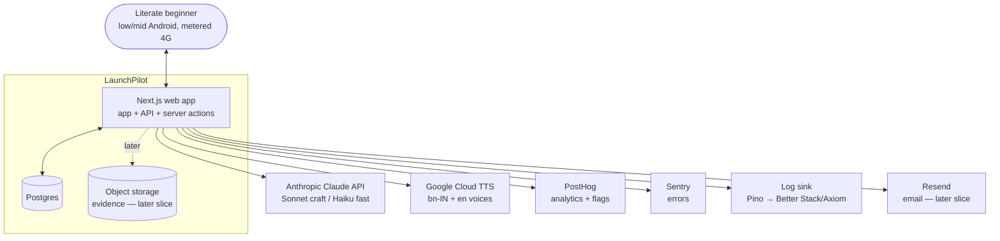
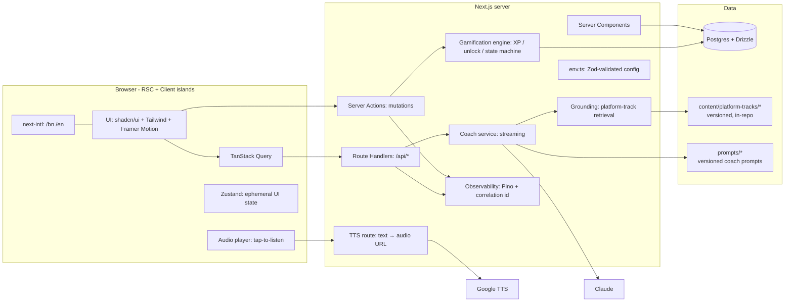
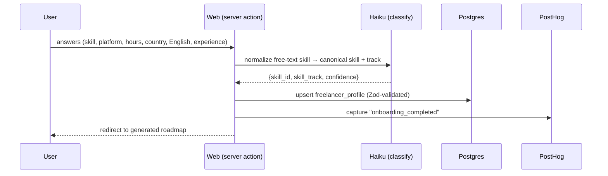
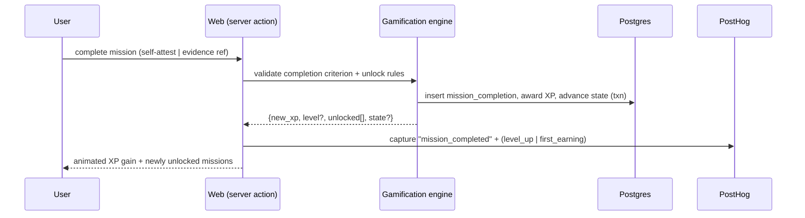
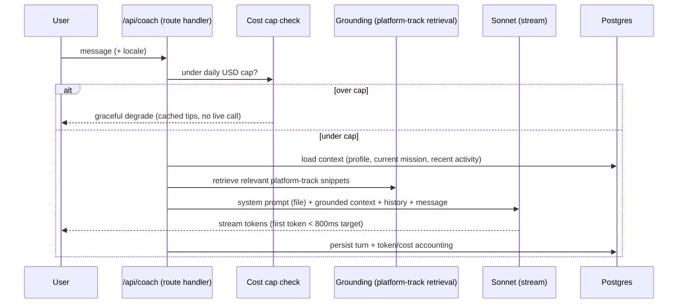
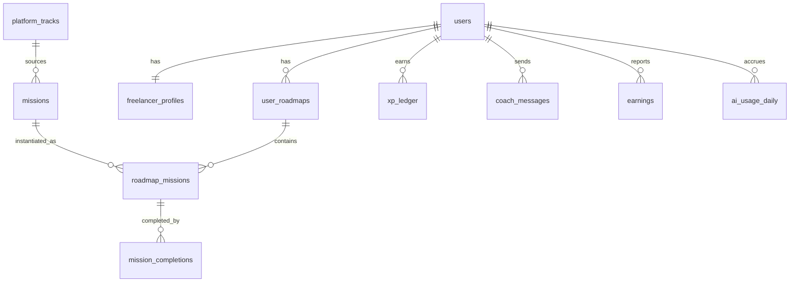
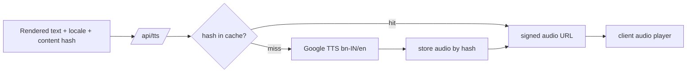
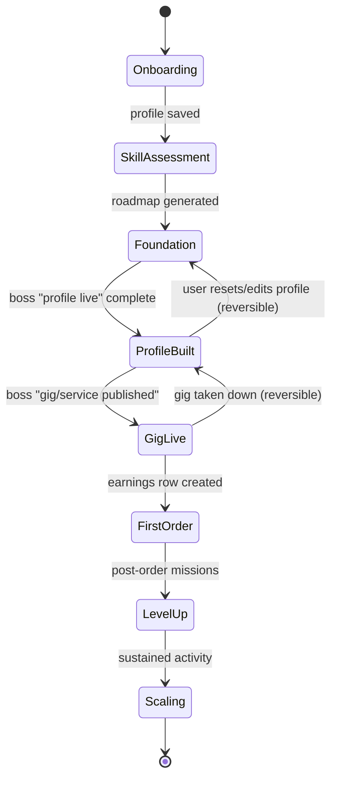

# LaunchPilot — Architecture

> Living document. Update it with every meaningful change. Diagrams are Mermaid so they
> render in GitHub. Every non-obvious choice carries a short *why*.

## 1. System context

LaunchPilot is **advisory only**. There is deliberately **no arrow from LaunchPilot to the
freelance marketplaces** (Fiverr/Upwork). We never call their APIs or scrape them. Platform
knowledge lives in version-controlled content authored from their public docs (see §6).

## 2. Component view

**Why server actions for mutations, route handlers for the coach:** mutations (complete a
mission, save profile) are first-party form posts — server actions give type-safe,
progressively-enhanced writes with no hand-written endpoint. The coach needs a **streaming**
HTTP response the client reads token-by-token, which is a route handler's job.

## 3. Data flow — the three journeys

### 3a. Onboarding → Freelancer Profile

*Why Haiku here:* mapping "I edit reels for my cousin's shop" → `video_editing` is cheap,
fast classification — exactly Haiku's job, not Sonnet's.

### 3b. Completing a mission

*Why a transaction:* XP, completion, unlock, and state transition must be atomic — a crash
mid-way must never leave XP without a completion, or a level-up that can be replayed.

### 3c. AI-coaching conversation (streaming + grounded)

## 4. Data model

Drizzle/Postgres. Conventions: `id` = uuid v7 (time-sortable), `created_at`/`updated_at`
timestamptz, soft-delete via `deleted_at` only where export/restore matters. Money in
integer **minor units** + currency code, never floats.

### Core tables (columns abbreviated; full DDL lives in `db/schema.ts`)

**`users`** — `id`, `email` (citext, unique), `name`, `locale` (`bn`|`en`), `auth_*`
(managed by better-auth tables), `created_at`, `deleted_at`.
*Auth session/account tables are owned by better-auth; we don't hand-roll them.*

**`freelancer_profiles`** — `user_id` (PK/FK, 1:1), `skill_id`, `skill_track`,
`target_platform` (`fiverr`|`upwork`|…), `weekly_hours` (int), `country` (default `BD`),
`english_confidence` (`low`|`medium`|`high`), `experience` (`none`|`some`|`experienced`),
`raw_inputs` **JSONB**, `journey_state`, `created_at`, `updated_at`.
*Why JSONB for `raw_inputs`, normalized for the rest:* the **typed** fields drive
personalization logic and must be queryable/indexable; `raw_inputs` keeps the user's
original free-text (e.g. their words for their skill) for coach context and future
re-classification, where schema-on-read is fine and over-normalizing would be churn.

**`platform_tracks`** — `id`, `platform`, `version` (semver), `status`
(`draft`|`published`), `payload` **JSONB** (rules, payout method, labeled heuristics),
`published_at`. *Versioned so we can update when a platform changes without breaking live
roadmaps; a roadmap pins the version it was generated against.*

**`missions`** — *templates*, not instances. `id`, `skill_track`/`platform` scoping,
`category` (`profile`|`skill`|`outreach`|`delivery`|`mindset`), `type`
(`daily`|`weekly`|`quest`|`boss`|`side`), `est_minutes`, `xp`, `completion_kind`
(`self_attest`|`evidence`|`ai_verify`), `unlock_rule` **JSONB**, `i18n_key`.
*Display text is NOT stored here as a string* — see §5 (bilingual content model).

**`user_roadmaps`** — `id`, `user_id`, `track_version_pins` JSONB, `generated_by`
(prompt/model version), `created_at`. **`roadmap_missions`** — the *instance* join:
`roadmap_id`, `mission_id`, `phase`, `quest`, `order`, `unlocked_at`, `status`.
*Why `missions` ≠ `mission_completions` ≠ `roadmap_missions`:* templates are authored once
and reused; a roadmap places them in personalized order with unlock state; completions are
an append-only event log. Collapsing these would make content edits rewrite user history.

**`mission_completions`** — append-only. `id`, `roadmap_mission_id`, `user_id`,
`completed_at`, `evidence_ref` (nullable), `verifier` (`self`|`ai`), `verifier_meta` JSONB.

**`xp_ledger`** — append-only ledger, not a counter. `id`, `user_id`, `delta`, `reason`,
`source_completion_id`, `created_at`. *Why a ledger:* current XP = `SUM(delta)`; an
append-only ledger is auditable, prevents double-award (unique on `source_completion_id`),
and makes "why am I level 3?" answerable.

**`earnings`** — the magic moment. `id`, `user_id`, `platform`, `amount_minor`, `currency`,
`reported_at`, `verifier`, `contribution_prompted_at`, `contribution_amount_minor`
(nullable). *First non-null row flips `journey_state` toward First Order and arms the
pay-what-you-want prompt. Billing integration is deferred but the shape is here now.*

**`coach_messages`** — `id`, `user_id`, `role`, `content`, `locale`, `tokens_in`,
`tokens_out`, `cost_usd_micros`, `model`, `created_at`.

**`ai_usage_daily`** — `user_id` + `usage_date` (PK), `cost_usd_micros`, `calls`. *Cheap
read for the per-user daily cap check on the hot path.*

**Key indexes:** `freelancer_profiles(target_platform, skill_track)` (roadmap gen),
`roadmap_missions(roadmap_id, status)`, `xp_ledger(user_id)`,
`mission_completions(user_id, completed_at)`, `coach_messages(user_id, created_at)`,
`ai_usage_daily(user_id, usage_date)`.

## 5. Bilingual content model + TTS pipeline

**Two kinds of text, two strategies:**
- **UI chrome** (buttons, labels, static copy) → `messages/{bn,en}.json`, served by
  next-intl. Translator-friendly, no DB hit.
- **Domain content** (mission objectives, quest descriptions, track guidance) → stored
  **per-locale** in a `content_strings` table keyed by `(i18n_key, locale)`, OR co-located
  in the versioned `content/platform-tracks/*` files as `{ bn, en }` objects. Missions
  reference an `i18n_key`, never a raw string, so adding a locale = adding a column of data,
  not a migration.

**Coach output** is generated in the user's `locale` directly by Claude (Sonnet handles
Bangla well); we do **not** machine-translate the coach — translation artifacts would make
it feel robotic. The coach also *scaffolds English for client comms* on request.

**TTS (tap-to-listen):**

*Why hash-cache:* the same mission text is heard by thousands of users — synthesize once,
serve forever. Keyed by content hash so editing the text invalidates naturally. Keeps TTS
cost near-zero at scale (ties to Principle 10).

## 6. AI integration strategy

- **Models:** **Sonnet** (`claude-sonnet-4-6`) for craft (chat, copy, critique). **Haiku**
  (`claude-haiku-4-5`) for classification (skill normalization, intent routing, cheap
  checks). Configurable via env.
- **SDK:** Vercel AI SDK for streaming + typed tool calls.
- **Grounding (anti-hallucination):** platform-specific answers retrieve from the pinned
  `platform_tracks` version and are injected into the prompt; the system prompt instructs
  the coach to **answer platform specifics only from provided context** and to **label
  heuristics as heuristics**. No grounded snippet → the coach says it doesn't know rather
  than inventing. (Directly mitigates R3.)
- **Structured outputs:** classification and roadmap-generation use **tool calls / JSON
  schema** validated by Zod; freeform only for conversational coaching.
- **Latency:** stream from first token; target P95 first-token < 800 ms. Pre-warm context
  load in parallel with the cost-cap check.
- **Cost control:** per-user **daily USD cap** (`AI_DAILY_USD_CAP_PER_USER`), token
  accounting on every turn (`coach_messages`, `ai_usage_daily`), Haiku-first routing,
  TTS hash-cache, and aggressive caching of roadmap generation. Over cap → graceful
  degrade to cached guidance, never an error.
- **Prompts as artifacts:** every system prompt lives in `prompts/*.md` under version
  control, never inline. Each has a version id recorded on generated rows (`generated_by`).
- **Eval harness (`pnpm eval`):** `evals/` holds input cases + scorers (refusal on TOS
  asks, no-hallucination when ungrounded, tone, bilingual correctness). Runs in CI; a
  prompt change that regresses fails the build. Built from day one (Slice 4).

## 7. Gamification model (formal)

- **XP per mission:** authored on the template, scaled by effort. Baseline:
  `xp = round(est_minutes * 1.5 * category_weight)`, where `category_weight` rewards
  real-world progress (`outreach` 1.5, `delivery` 1.5, `skill` 1.2, `profile` 1.0,
  `mindset` 0.8).
- **Level curve:** cumulative XP for level *n* = `round(100 * n^1.6)`. Five named tiers map
  to level bands: **Apprentice** (1–4) → **Practitioner** (5–9) → **Specialist** (10–15) →
  **Authority** (16–22) → **Mentor** (23+). Super-linear curve so early wins feel fast and
  mastery feels earned.
- **Mission types:** Daily (small, habit), Weekly (momentum), Quest (themed arc), Boss
  (milestone gate, e.g. "publish your gig"), Side (optional depth).
- **"Complete" means:** `self_attest` (honor-system, low-stakes), `evidence` (a ref/URL —
  stored as metadata, content ephemeral; full verification is Slice 7), or `ai_verify`
  (soft plausibility signal only — **never** the system of record; self-attestation
  remains authoritative, per R-decision on uploads).
- **Streaks & freeze:** one freeze per 7 days; missing a day with a freeze available keeps
  the streak (Duolingo-style anti-rage-quit).
- **Anti-gaming (built in from the start):** **XP is awarded only on `mission_completion`
  rows tied to real-world actions.** Logging in = 0 XP. Reading content = 0 XP. The
  `xp_ledger` unique constraint on `source_completion_id` blocks replay. Boss missions gate
  progression so users can't skip fundamentals into advanced content.
- **Confidence Meter:** `actual = completed_foundational / total_foundational`; `perceived`
  is self-reported at onboarding. Showing the gap is the coaching signal.

## 8. Journey state machine

**Triggers** are domain events (mission completion, earnings report, profile edit).
**Reversible** transitions exist where reality is reversible (a gig can come down). Forward
transitions past `FirstOrder` are **not** reversible — you don't un-earn money. The machine
is a pure function `(state, event) → state` so it's unit-testable in isolation (TDD target).

## 9. Observability strategy

- **Logs:** Pino structured JSON, every server action / route handler / job emits with a
  **correlation id** (generated at the edge, threaded through). Principle 1: I can pick any
  user action and reconstruct it. Ship to Better Stack/Axiom (added when it earns its place;
  console in skeleton).
- **Traces:** the correlation id spans client action → server → Claude/TTS → DB.
- **Metrics:** mission completions/day, AI calls/day + cost, P95 coach first-token, error
  rate, sign-up funnel, **activation** (sign-up → first mission), **first-earning funnel**.
- **Alerts:** error-rate spike, P95 latency breach, daily AI cost anomaly.
- **Dashboards:** the single "system breathing" page is Slice 12; the underlying events are
  emitted from day one so the dashboard is just a read.

## 10. Security & privacy model

- **Auth:** better-auth — email + magic link + Google. Sessions httpOnly, secure,
  SameSite=Lax; CSRF protection on mutations; rotation on privilege change.
- **PII:** minimal by design (email, name, locale, self-described skill). Country at
  region granularity. No payment data stored at MVP (success-based billing is later, via BD
  rails).
- **Uploads (later slice):** evidence is metadata-first; any image is processed for a
  plausibility signal and then **ephemeral** (short retention), with an explicit "what we do
  with your uploads" disclosure and one-click delete. Decided up front to avoid storing
  beginners' screenshots full of PII (R1/R3).
- **GDPR-grade hygiene at MVP:** full data **export** + one-click **account deletion**
  (hard-delete of PII, anonymized retention of aggregate metrics).
- **Rate limiting:** per-user + per-IP on auth and `/api/coach`.
- **Prompt-injection defenses:** user content is data, never instructions; the system
  prompt is fixed and file-based; grounded snippets are clearly delimited; tool calls are
  schema-validated; the coach refuses to exfiltrate its prompt or act on injected commands.
- **Secrets:** never in the repo; validated by `lib/env.ts` at boot; documented in
  `.env.example`.

## 11. Performance budgets

Mid-range Android over 4G: **LCP < 2.0 s, INP < 200 ms, CLS < 0.1**; AI streaming first
token **< 800 ms**. Enforced in CI on a synthetic profile; regressions fail the build.
Tactics: RSC-first, minimal client JS, route-level code-split, TTS/audio lazy + cached,
image discipline, no blocking third-party scripts on first paint.

## 12. Brand (for owner sign-off)

- **Coach name:** propose **Sol / Remi / Atlas** — owner picks (also in `discovery.md`).
- **Palette (proposed):** warm, optimistic, modern; one accent.
  - Accent: **Marigold `#F5A524`** (warmth, sunrise/launch, culturally resonant in BD).
  - Ink: `#1C1917` · Surface: `#FAFAF9` · Muted: `#78716C` · Success: `#16A34A`.
  - One accent only, generous whitespace, purposeful motion. No stock photos, no
    cartoon-people-high-fiving, no 2019 startup-landing-page energy.
